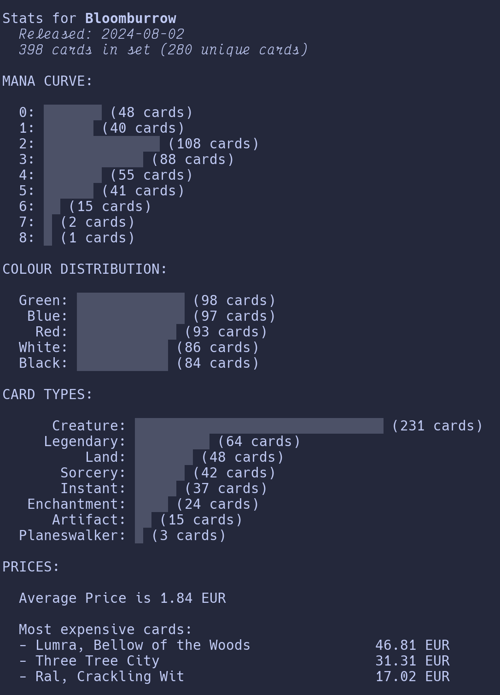

# _"scry a card, planeswalker..."_ 🔮🃏

Leveraging [scryfall](https://scryfall.com/docs/api) to get stats for MTG cards

  

## setup

Clone and install with `pipx install scry`

## use

- Request a reference list of set releases with: `scry setlist`
- Get stats for a specific set:
  - `scry set BLB` returns all cards from the _Bloomburrow_ set
  - `scry set latest` finds the most recent release.
- Get stats for cards based on a scryfall [search query](https://scryfall.com/docs/syntax):
  - `scry search id:orzhov type:land legal:modern` returns all unique Orzhov Land cards that are legal in Modern format, and shows stats for that list.
- Get help with `scry --help`

### local database

Scry creates a local sqlite database and adds your queried cards to it. This means you can build a larger collection of cards by executing multiple searches, and then view stats for the entire database with `scry stats`

To clear your database (for instance, to start a fresh collection to view stats on), run `scry clear` and confirm at the prompt.

## about

Made with python and sqlite, and requests to the [scryfall](https://scryfall.com/docs/api) API.
This is a personal project to learn more about python packaging, sqlite, pytest, and MTG sets.
